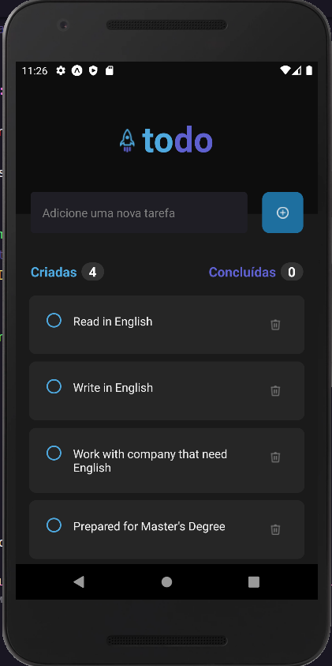
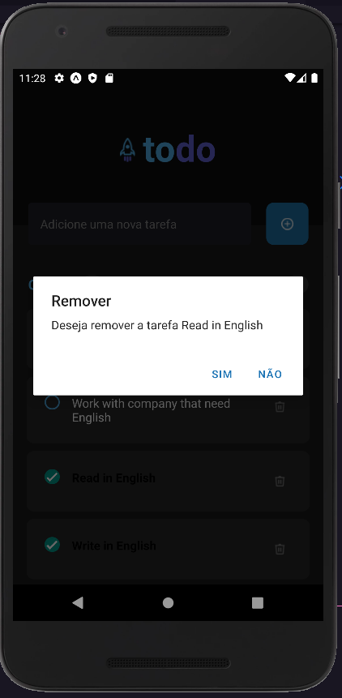
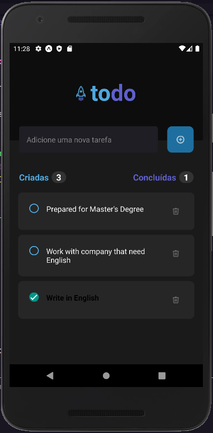
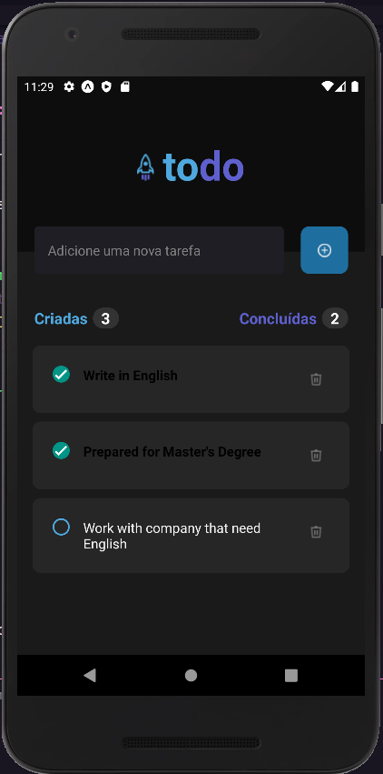

# Challange List To-Do

## On the Home screen we will find a place to insert the name of the task

## The second part is adding your tasks

## The third part is to finish the tasks accomplished!
- In my case, I'm informing that I can read and write in English :D
## You can delete any task whether completed or not

PS: If you delete a task done, it will be forgotten by the counter

## Well I'll leave my pretensions

